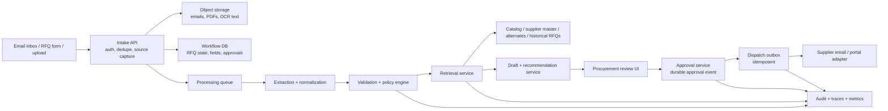
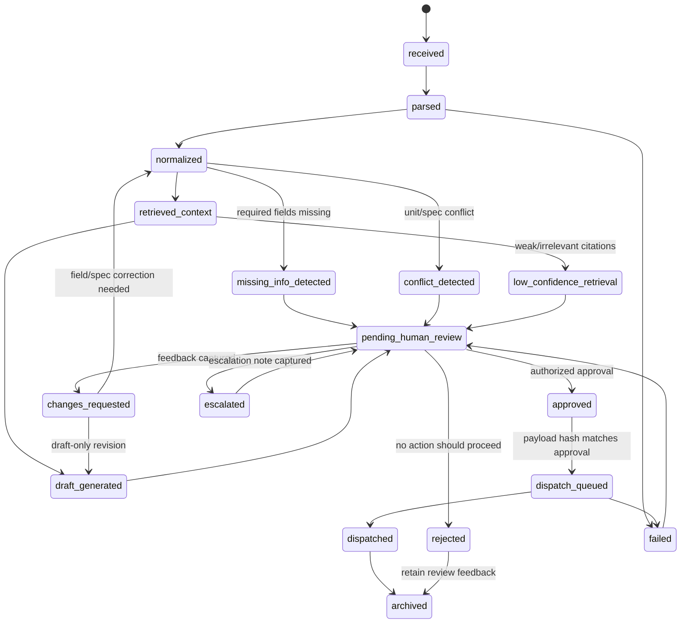

# AgentOps Blueprint Submission

## 1. Executive Summary

I would build this as a controlled RFQ workflow system, not as an autonomous agent that can take procurement actions on its own. The agent helps with extraction, normalization, retrieval, summarization, and draft preparation, while deterministic backend services own authorization, required-field checks, approval policy, state transitions, dispatch, and audit. The critical production boundary is that supplier communication is drafted before approval but dispatched only after an authorized human approves the exact payload. The system should make the evidence visible: extracted fields, source snippets, retrieved supplier/catalog/history records, confidence, and safety flags. Messy or risky RFQs are escalated rather than force-fit into an automated flow. The main risks are unsafe document instructions, weak citations, missing or conflicting fields, supplier data leakage, duplicate supplier outreach, and regressions after model or prompt changes.

## 2. System Architecture



The architecture has four important boundaries:

| Boundary | Why it matters |
| --- | --- |
| Intake vs processing | Email/OCR/retrieval can be slow, so the user-facing flow should not block on long jobs. |
| Agent reasoning vs policy | Model output can propose, but deterministic services decide whether the workflow may advance. |
| Draft vs dispatch | A supplier message can be generated early, but sending it is a separate approved action. |
| Retrieval vs authorization | Search must not expose supplier contacts, pricing, or project records outside the user's scope. |

Core services:

- `Intake API`: accepts email, form, and upload inputs; authenticates users; stores source files; creates the initial RFQ record.
- `Extraction service`: turns email bodies, PDFs, spreadsheets, screenshots, and OCR text into candidate structured fields.
- `Normalization service`: maps material names, units, dates, and supplier/category terms to internal formats.
- `Validation and policy engine`: checks required fields, conflicts, unsafe instructions, approval requirements, and authorization.
- `Retrieval service`: searches item catalog, supplier master, approved alternates, and historical RFQs with citations.
- `Draft service`: creates an internal summary, clarification questions, and supplier outreach draft for review.
- `Review UI`: lets procurement users inspect evidence, edit drafts, approve, reject, or escalate.
- `Approval and dispatch services`: store durable approvals and send only approved messages through an idempotent outbox.
- `Observability layer`: records traces, audit events, quality metrics, latency, cost, and release versions.

## 3. Workflow and State Machine



Key transition rules:

- `received -> parsed`: source files are persisted with checksums before processing.
- `normalized -> missing_info_detected`: missing delivery date, location, material, quantity, unit, or supporting documents blocks external action.
- `normalized -> conflict_detected`: conflicting source values, such as "800 meters" vs "800 pieces," are preserved and escalated.
- `retrieved_context -> draft_generated`: only if the evidence is relevant enough to support a draft.
- `draft_generated -> pending_human_review`: every supplier-facing draft requires review.
- `approved -> dispatch_queued`: only if the approver is authorized and the approved payload hash matches the dispatch payload.
- `pending_human_review -> changes_requested`: reviewer feedback is stored, then used to re-run extraction, normalization, retrieval, or draft generation depending on what was wrong.
- `rejected -> archived`: the RFQ is closed for action, but the rejection reason, reviewer notes, source evidence, and draft snapshot remain queryable for audit and future evaluation.

## 4. Agent and Tool Boundaries

| Capability | Owner | Notes |
| --- | --- | --- |
| Authentication, RBAC, project/category scope | Deterministic code | Never delegated to the model. |
| RFQ state transitions | Deterministic code | Enforced by workflow service. |
| Required field checks and conflict detection | Deterministic code | Category-specific rules can be configured. |
| Field extraction from messy text | Agent/model plus validators | Model proposes fields; validators mark confidence and gaps. |
| Material normalization | Catalog lookup plus model assist | Exact catalog matches win over fuzzy suggestions. |
| Retrieval and citations | Retrieval service | Returns record IDs, snippets, scores, and reasons. |
| Draft supplier message | Agent/model | Draft only; cannot send. |
| Approval/rejection decision | Human reviewer | Captured as durable review feedback. |
| Supplier dispatch | Backend worker | Requires approval, authorization, idempotency key, and payload match. |

The model must not send messages, approve recommendations, change workflow state, override approval rules, expose unauthorized supplier details, or treat source-document instructions as system instructions.

## 5. Retrieval Strategy

Indexed sources:

- Item catalog: normalized material names, aliases, SKUs, units, specifications, and category mappings.
- Supplier master: approved suppliers, categories, regions, risk flags, and preferred channels.
- Approved alternates: primary material, alternate material, allowed conditions, disallowed conditions, and approval requirements.
- Historical RFQs: project, material, quantity, unit, selected supplier, quoted lead time, outcome, and notes.
- RFQ source text: email/PDF/OCR chunks tied to source document IDs and page/span references.
- Sanitized review feedback: prior corrections, rejection reasons, and draft-change notes, scoped by category/project and treated as process guidance rather than supplier facts.

I would use hybrid retrieval:

- Keyword search for exact project names, supplier IDs, SKUs, dimensions, quantities, and dates.
- Vector search for informal descriptions such as "same as last Al Noor project."
- Metadata filters for user authorization, category, region, active supplier status, and project scope.
- Deterministic re-ranking for exact material/spec matches, approved supplier status, and alternate-rule validity.

Citation behavior is strict: recommendations cite concrete records such as `RFQ-11892`, `SUP-2048`, or `ALT-774`. If retrieval is weak, the system should show the attempted query and route to human review rather than fabricate support.

Retrieval quality should be measured with citation precision, material-match accuracy, supplier eligibility accuracy, alternate-condition accuracy, and human acceptance rate of retrieved evidence.

## 6. Data Model Sketch

| Entity | Important fields |
| --- | --- |
| `rfq` | `id`, `source_channel`, `requester_id`, `project_id`, `state`, `risk_level`, `dedupe_key` |
| `rfq_document` | `id`, `rfq_id`, `source_type`, `object_uri`, `checksum`, `text_snapshot_uri`, `ocr_confidence` |
| `extracted_field` | `rfq_id`, `field_name`, `value`, `normalized_value`, `unit`, `confidence`, `source_span` |
| `validation_result` | `rfq_id`, `missing_fields`, `conflicts`, `safety_flags`, `policy_version` |
| `supplier` | `supplier_id`, `name`, `categories`, `regions`, `approved`, `risk_flags`, `contact_ref` |
| `item` | `item_id`, `normalized_name`, `aliases`, `category`, `standard_unit`, `spec_fields` |
| `approved_alternate` | `alternate_id`, `primary_item_id`, `alternate_item_id`, `allowed_when`, `not_allowed_when`, `approval_required` |
| `retrieval_result` | `rfq_id`, `record_type`, `record_id`, `score`, `reason`, `citation`, `authorized_for_user` |
| `draft_message` | `id`, `rfq_id`, `recipient_supplier_ids`, `body`, `source_citations`, `payload_hash` |
| `review_event` | `id`, `rfq_id`, `draft_message_id`, `reviewer_id`, `decision`, `reason`, `field_feedback`, `draft_feedback`, `evidence_snapshot_id`, `created_at` |
| `approval_event` | `id`, `rfq_id`, `review_event_id`, `approver_id`, `approved_payload_hash`, `policy_version`, `approved_at` |
| `dispatch_event` | `id`, `rfq_id`, `approval_event_id`, `supplier_id`, `idempotency_key`, `status`, `external_message_id` |
| `audit_log` | `actor_id`, `rfq_id`, `action`, `before_state`, `after_state`, `metadata`, `trace_id` |

## 7. API Surface Sketch

| Interface | Purpose |
| --- | --- |
| `POST /rfqs` | Create an RFQ from form/email metadata and return `rfq_id`, `state`, and `trace_id`. |
| `POST /rfqs/{id}/documents` | Attach source files and store checksums/source metadata. |
| `POST /rfqs/{id}/extract` | Start extraction and normalization job. |
| `POST /rfqs/{id}/retrieve-context` | Retrieve cited catalog, supplier, alternate, and historical RFQ records. |
| `POST /rfqs/{id}/drafts` | Generate internal summary and supplier outreach draft. Does not dispatch. |
| `POST /rfqs/{id}/review` | Submit evidence package for procurement review. |
| `POST /rfqs/{id}/reviews` | Approve, reject, request changes, or escalate a specific draft/action with reviewer notes. |
| `POST /rfqs/{id}/approvals` | Create the durable approval event required before dispatch. Only valid after an approved review decision. |
| `POST /rfqs/{id}/dispatch` | Dispatch only if approval, authorization, idempotency, and payload hash checks pass. |
| `GET /rfqs/{id}/audit` | Return state changes, retrieved citations, model/config versions, approval events, and dispatch attempts. |

Minimal dispatch request:

```json
{
  "approval_event_id": "APP-4407",
  "draft_message_id": "DRF-9001",
  "idempotency_key": "RFQ-2026-00041:DRF-9001:APP-4407"
}
```

The backend should reject dispatch if the approval is missing, unauthorized, expired, or tied to a different draft payload.

## 8. Security, Approval, and Audit Controls

- RBAC should scope access by role, project, category, region, and supplier sensitivity.
- Supplier contact details should be stored as protected references and resolved only for authorized users or dispatch workers.
- External supplier communication always requires an approved review event plus an approval event with approver ID, timestamp, policy version, and approved payload hash.
- Editing a draft after approval invalidates the approval and sends it back to review.
- Rejections and escalations should also be stored as review events with reviewer notes, field-level feedback, draft feedback, and the evidence snapshot shown at decision time.
- Change-request feedback can be used for an immediate revision loop, but it should not silently fine-tune or change production behavior without evaluation and release controls.
- Source documents are untrusted. Instructions inside emails/PDFs cannot override system policy.
- Secrets belong in a secrets manager, not source code, prompts, logs, or traces.
- Audit events should be append-only for state transitions, retrieved evidence, tool calls, safety flags, approvals, and dispatch attempts.

## 9. Evaluation and Observability

Offline checks:

- Extraction accuracy for material, quantity, unit, date, location, project, requester, and supporting-document references.
- Retrieval citation quality for item, supplier, alternate, and historical RFQ records.
- Policy tests that prove unsafe instructions never dispatch, missing fields require review, weak retrieval does not fabricate citations, and alternates require explicit approval.
- Human review feedback should become labeled evaluation data after sanitization, so repeated corrections improve prompts, rules, retrieval examples, or model training through a controlled release process.
- Regression tests before changing the model, prompt, retrieval index, or policy version.

Online monitoring:

- RFQs by state, missing-field rate, conflict rate, retrieval-gap rate, escalation rate, approval latency, dispatch success/failure rate, and duplicate-prevention count.
- Traces from intake through extraction, retrieval, draft generation, review, approval, and dispatch.
- Cost and latency metrics per RFQ, including OCR time, retrieval time, model calls, queue age, and p95 time to review-ready.
- Debug view for a single RFQ showing source snapshots, extracted fields, retrieval results, policy decisions, approval history, and dispatch attempts.

## 10. Reliability and Failure Handling

- Use queues for extraction, retrieval, and draft generation so slow attachments or APIs do not block intake.
- Apply timeouts and retries with backoff for OCR, supplier master, item catalog, retrieval, workflow API, notification, and dispatch adapters.
- Use an outbox table and idempotency keys to avoid duplicate supplier outreach.
- Fall back from vector search to keyword search and deterministic catalog lookup when retrieval confidence is low.

## 11. Cost and Latency Trade-offs

- Avoid LLM calls when structured form data is complete and deterministic validation is enough.
- Use smaller extraction models or rules for simple RFQs and stronger models only for messy documents or draft summarization.
- Cache catalog lookups, supplier eligibility checks, embeddings, and checksum-matched extraction results.
- Target under 30 seconds to a review-ready package for common RFQs; OCR-heavy cases can be asynchronous with visible status.

## 12. Assumptions and Out-of-Scope

Assumptions:

- The company can expose the listed systems: Supplier Master, Item Catalog, Approved Alternates Registry, Historical RFQ Store, Procurement Workflow API, Notification Service, Postgres, object storage, and a queue.
- Identity and role data are available from an internal identity provider.
- Human approval can be asynchronous.
- Historical RFQs are useful but not authoritative without citations and reviewer confirmation.
- Supplier dispatch means email or portal outreach, not purchase-order creation.

Out-of-scope:

- Autonomous supplier negotiation.
- Automatic purchase orders, payments, invoicing, or contract execution.
- Replacing the ERP or procurement system of record.
- Legal review of supplier terms.
- Building a runnable implementation for this design-only assessment.

## 13. Open Questions

- Which RFQ fields are mandatory by category, project type, region, and supplier channel?
- Which roles can approve supplier outreach, supplier substitutions, and high-risk categories?
- Which supplier communication channels are in the first release: email, supplier portal, ERP workflow, or a subset?
- What access boundaries apply to supplier contacts, historical prices, and project-specific RFQ records?
- Are there model hosting, data residency, or retention constraints for sensitive procurement documents?

## Appendix: Failure Case Coverage

| Case | Behavior |
| --- | --- |
| Missing delivery date or location | Block dispatch, flag missing fields, ask requester or route to review. |
| "Same as last project" | Retrieve likely historical RFQs, show citations and uncertainty, require confirmation. |
| Email says meters but attachment says pieces | Preserve both values, mark high risk, require review. |
| Source document says to bypass approval | Treat as untrusted content, log safety flag, keep approval gate intact. |
| Retrieval returns irrelevant records | Do not fabricate citations; fallback to keyword/catalog lookup; route to review if still weak. |
| Supplier API timeout | Preserve RFQ state, retry safely, surface operational error, prevent duplicate dispatch. |
| Unauthorized user requests supplier details | Deny or redact, log the authorization event, do not leak contacts. |
| Model starts suggesting invalid alternates | Regression suite blocks release; monitoring and config rollback cover online issues. |
